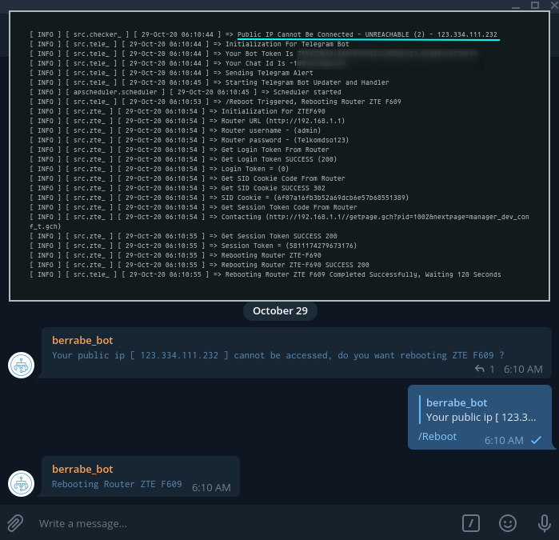

<p align="center">
  
</p>


### TLDR;
---
I have a server on the local network under router ISP (ZTE F609), isp will give me dynamic public ip,
so i can access all my local servers from outside the network / internet without having to pay for static ip service,
btw i have dynamic dns service, which will automatically replace my domain ip to my public ip dynamically

but the weakness is, if the router shuts down / reboots (maybe due to dead electricity / maintenance),
my public ip will change randomly (of course, this is dynamic public ip), and not all dynamic ip that is given by ISP can be accessed from outside (some public ip from ISP is shared public ip,
where 1 public ip is used by several ISP clients, so you can't do forwarding packet / traffic from the ISP to your local network)

That's why I created this program, which is useful for checking whether my public ip can be accessed? if it can't,
then the program will not reboot the ISP router directly to get a new public ip which 'maybe' is not a shared public ip.
But the program will send notification to telegram first with 3 command options, do you want to reboot? or not? or check the current ip information

### USAGE
---
- a very general first step, clone this repo, and do a few steps like the steps below to make sure this program can run perfectly
```sh
git clone https://github.com/berrabe/python-telegram-ztef609.git
cd python-telegram-ztef609
pip install -r requirements.txt
```

- all processes starting from detection and testing of public ip, updater and handler for telegram bot, and to reboot zte router have been done automatically by the program itself.
What needs to be done is setting the parameters that will be needed for the program to do its job, 
for example, such as the telegram bot token, telegram chat id ... and some of the credentials needed to login to the zte f609 router
```python
if status == 'UNREACHABLE':

  obj = tele_.TelegramBot(
    token_telegram = 'YOUR TELEGRAM BOT TOKEN',
    chat_id_telegram = 'YOUR TELEGRAM CHAT ID',
    router_ip_address = 'http://192.168.1.1',
    router_user = 'admin',
    router_password = 'Telkomdso123')
```

- lastly, run this program with the command
```sh
python main.py
```

- by default, the program will display all events that occur behind the scenes in the terminal. 
You can change it to not appear in the terminal, but enter the file by removing the "#" sign here.
You can see all the logs in a file called python-ztef609.log
```sh
# filename='python-ztef609.log', filemode='a',
```

### SCREENSHOT
---
<p align="center">
  
  <br>
  if normal (your public ip can be pinged from outside) nothing will happen
</p>
<br>
<p align="center">
  
  <br>
  if the public ip cannot be accessed, the program 
  will automatically send a notification to telegram with 3 custom commands
</p>
<br>
<p align="center">
  
  <br>
  if you want to see information from the current public ip, ignore the fake ip 123.334.111.232
</p>
<br>
<p align="center">
  
  <br>
  if you select /No, the program will shut down itself, and can't handle new telegram command
</p>
<br>
<p align="center">
  
  <br>
  if you select /Reboot, The program will automatically perform a sequence of steps to reboot the ZTE F609 router
</p>